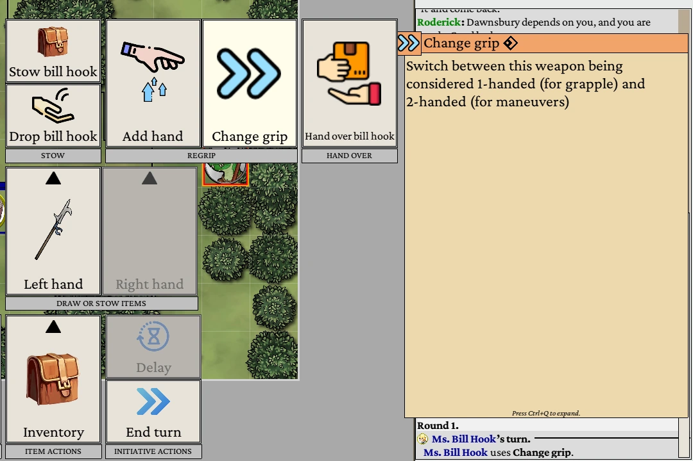

# Bill Hook

This is like the [Gill Hook](https://2e.aonprd.com/Weapons.aspx?ID=156), but more formally a polearm -
a 1d10 Piercing Reach weapon that you can Grapple with!

Now here comes the quirky part: Dawnsbury Days doesn't currently support grappling with a two-handed weapon,
so you get a "Change grip" pseudo-action in Inventory ➜ Bill Hook ➜ Regrip:

This allows to use Bill Hook both for grapples and for meta-strikes that require a two-handed weapon!

<!--
[Source code](https://github.com/YAL-Game-Things/DawnsburyDaysMods/tree/main/YALsGillHook)

Polearm shape from [The Book of Traceable Heraldic Art](https://heraldicart.org/polearm/)
-->

## Credits
A mod by YellowAfterlife

Polearm shape from [The Book of Traceable Heraldic Art](https://heraldicart.org/polearm/)!